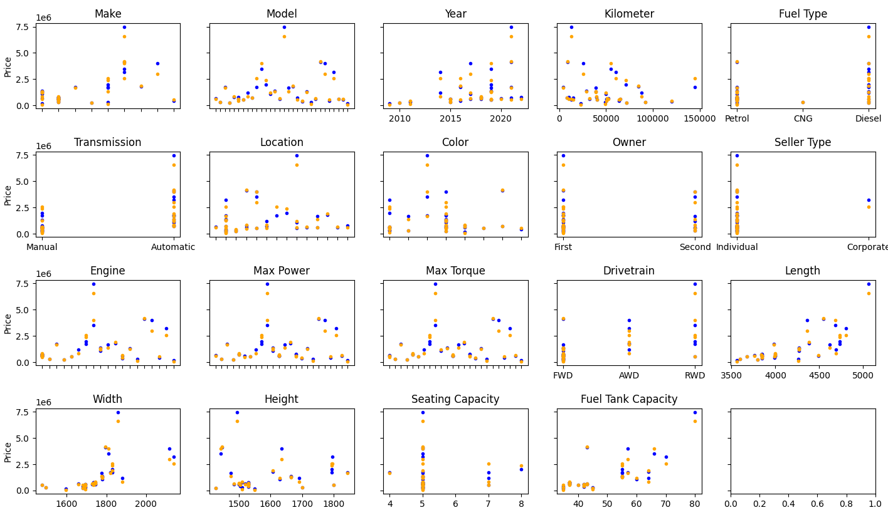

# Given data

Data set of used cars.

**Shape**: (2059, 20)

Source:
https://www.kaggle.com/datasets/nehalbirla/vehicle-dataset-from-cardekho

# Goal

Make a linear regression model that estimates car prices. Without using frameworks and libraries for it.

**Dependent variable**: Price

# Data analysis & feature engineering

## Make

Categorical property with 33 unique values. This property is determined by _Model_ property, which is
categorical too. So, we won't use this one.

## Model

Categorical property with 1050 unique values.


We can't use categorical properties for linear regression, so we need to digitize it. Mean price for model and cost of a
car have almost perfect correlation with coefficient. r(model mean price, price)=0.989994


So, we're going to derive **model mean price** feature from this property.

## Year

Correlation with price is evident.


Will **use it as a feature**.

## Kilometer

Correlation with price is -0.150825. It's considerable.


Will **use it as a feature**.

## Fuel type

Categorical property with 9 unique values. Doesn't seem to affect price alot.


But r(fuel mean price, price)=0.201544, which is considerable.


So, we'll derive **fuel mean price** feature from this one.

## Transmission

Categorical property with 2 unique values.


Since this property takes only two values, we're going to derive **transmission auto** dummy feature. It will be equal 1
when
transmission is automatic, and 0 otherwise.

## Location

Categorical property with 77 unique values. It affects price.


r(location mean price, price)=0.290479.


So, we'll derive **location mean price** feature from this data.

## Color

Price depends on color a little. Yellow, black and blue cars are most expensive.


r(color mean price, price)=0.270957.


Also, we have:
r(color mean price, width)=0.312587
r(color mean price, length)=0.261747
Even though these coefficients are bigger than coefficient with price, we can't replace these properties by width and
height. We'll derive **color mean price** feature.

## Owner

Categorical property with 6 unique values.


Unregistered cars and cars with three owners appeared to be the most expensive! Especially unregistered ones.


We can't contest statistics. So, instead of converting words to corresponding digits manually, we will just derive
**owner mean price** feature.

## Seller type

Categorical property with 3 unique values. Mean price per seller type looks linear.


However, r(seller type mean price, price)=0.099019.


And still, that's some additional data, so we'll make use of **seller type mean price** feature.

## Engine

Engine info is stored in format: 'XXXX cc', we're going to parse **engine displacement** feature from it.
r(engine displacement, price)=0.615328.


## Max power

Max power has format: 'XXX bhp YYYY rpm'. We can derive two features from it: **bhp** and **bhp rpm**. Obviously, the
more powerful engine is, the bigger its price is likely to be. r(bhp, price)=0.781287.


But for greater max bhp rpm price is usually smaller. r(bhp rpm, price)=-0.197078.


## Max torque

Max torque has format: '620 Nm @ 2000 rpm'. Two features available: **torque** and **torque rpm**.
r(torque, price)=0.671290


r(torque rpm, price)=-0.314132


## Drivetrain

Categorical property with 3 unique values.


r(drivetrain mean price, price)=0.534099
Also, we have other interesting correlations:
r(drivetrain mean price, fuel capacity)=0.727644
r(drivetrain mean price, width)=0.638947
r(drivetrain mean price, length)=0.575518
But estimates would be still more precise if we keep this parameter. And it shouldn't break our model. So, we make **
drivetrain mean price** feature out of it.

## Length

Correlates with price at rate 0.556741.


This correlation is mediocre, but we can do better. If we find area from length and width, the correlation
will rise. r(area, price)=0.603992.


And it kinda makes sense. No matter whether vehicle is long or wide - if it's big, then it's more expensive.
Will derive **area** feature but also try using **length** with it.

## Width

Correlates with price at rate 0.563996.


This property will be used to find area, which will give us more correct results. But we'll also still try to **use
width as a feature**.

## Height

Correlates with price at rate 0.075080.


This is very small. But on the plot we see that there are very some expensive cars among both very low and very high car
types. Sport cars and big trucks are both expensive, so price relates to height in a parabolic manner. Therefore, we can
develop a new feature: **parabolic height**. PH = (H - mean(H)) ** 2. And indeed, the correlation of this new parameter
with price is 0.189915!


And we're still going to also **use height as a feature**.

## Seating capacity

The correlation with price is very small. r(seating capacity, price)=-0.038524.


But let's **use it as a feature**, because it's an additional piece of data.

# Tests

### Using unknown models

Learning curve:


Estimates (blue - actual value; orange - estimated):


Log:

```text
Car raw DF shape: (2059, 20)
Car valid DF shape: (1872, 20)
Car training DF shape: (1822, 20)
Car testing DF shape: (50, 20)
Initial cost: 4.5066e+12
Convergence cost: 5.19142e+10
Average relative error: 0.78 +- 0.18
```

### Filtering out unknown models

Learning curve:


Estimates (blue - actual value; orange - estimated):



Log:

```text
Car raw DF shape: (2059, 20)
Car valid DF shape: (1872, 20)
Car training DF shape: (1822, 20)
Car testing DF shape: (31, 20)
Initial cost: 4.4651e+12
Convergence cost: 5.35821e+10
Average relative error: 0.17 +- 0.03
```

# Conclusion

We trained a model which estimates car price with **17% precision**. If model was not present in the training set, then
price is estimated with **78% precision**.
This is the case because price heavily depends on model. There are 1050 unique models within the whole dataset of 2059
cars. This means that, in average, for any given model there are only two examples present in the data set. Or, if we
pick a random car for testing there's a 50% chance that its model occurs either only once or not at all in the remaining
data. If model doesn't occur in the training set, program uses mean price of mean prices for all models, but it is very
loose estimate, because prices in the dataset vary by orders of magnitude. If model occurs only once, the average price
for model equals the price of that specific instance, which is not representative. Therefore, **the main reason of
prediction error is insufficiency of examples in the data set**. The other way to improve results is to manually specify
correct mean prices for desired models.
